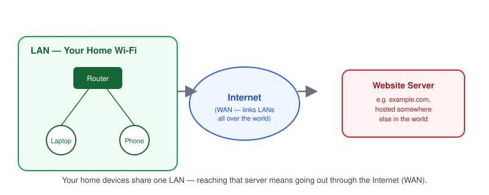
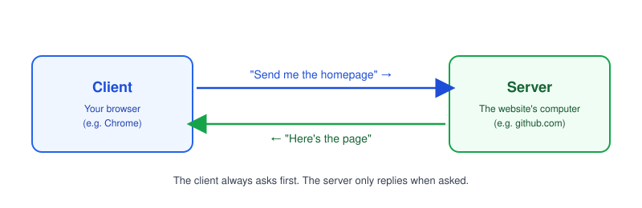
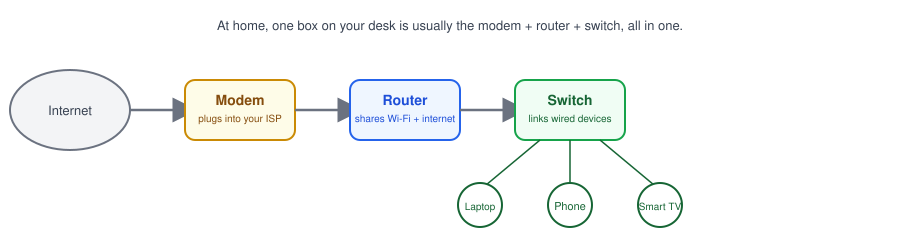
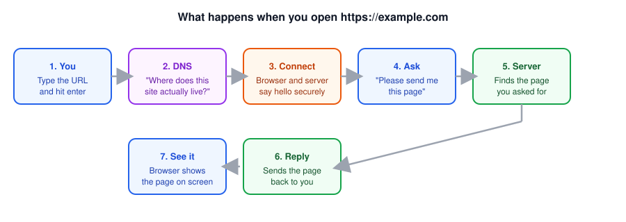

# Part 1: What Is a Network?

## Table of Contents

- [1. What Is a Computer Network?](#1-what-is-a-computer-network)
- [2. LAN, WAN, and the Internet](#2-lan-wan-and-the-internet)
- [3. Client and Server](#3-client-and-server)
- [4. How Devices Communicate](#4-how-devices-communicate)
- [5. Network Devices: Router, Switch, Modem](#5-network-devices-router-switch-modem)
- [6. Real-World Example: What Happens When You Open a Website?](#6-real-world-example-what-happens-when-you-open-a-website)

---

## 1. What Is a Computer Network?

A **computer network** is two or more devices connected together to share data.

As a developer, you're already using networks every day:

- Calling an API from the frontend
- Connecting a backend to a database
- `ssh`-ing into a server
- `docker pull`-ing an image

> **Note:** This series skips network-engineering theory and focuses only on what developers actually run into.

## 2. LAN, WAN, and the Internet

| Term     | Scope                      | Example                          |
| -------- | -------------------------- | -------------------------------- |
| LAN      | Single location            | Home Wi-Fi, office network       |
| WAN      | Multiple locations, linked | Company offices across cities    |
| Internet | Global                     | Your app talking to a public API |

> **Note:** "Works on `localhost`, breaks in production" is usually a LAN → Internet boundary problem — something in between (firewall, NAT, DNS) behaves differently.

## 3. Client and Server

- **Client** — initiates the request (browser, mobile app, another backend service).
- **Server** — listens and responds (your API, your database, your load balancer).
- A machine can be both: your backend is a _server_ to the frontend, but a _client_ to the database.

> **Note:** A client needs an **address** ([IP](../02-ip-address)) and a **door number** ([port](../04-ports)) to reach a server — covered next.

## 4. How Devices Communicate

Data travels in small chunks called **packets**, each tagged with a source and destination — like an envelope with a return and delivery address.

To talk, two devices need:

1. **An address** — [IP address](../02-ip-address), [MAC address](../03-mac-address)
2. **A port** — which application on the device should get the data ([Part 4](../04-ports))
3. **A shared protocol** — the rules for formatting data ([TCP/UDP](../05-tcp-vs-udp), [HTTP](../06-http-and-https))

## 5. Network Devices: Router, Switch, Modem

- **Modem** — bridges your network and your ISP.
- **Router** — routes traffic between your LAN and the Internet; usually handles [NAT](../11-nat).
- **Switch** — connects devices _within_ the same LAN, sending data only to the device it's addressed to.

## 6. Real-World Example: What Happens When You Open a Website?

1. Browser needs an IP for the domain → asks [DNS](../07-dns).
2. Opens a connection via [TCP](../05-tcp-vs-udp), negotiates TLS for HTTPS ([Part 6](../06-http-and-https)).
3. Sends an [HTTP request](../06-http-and-https); it may pass through a [reverse proxy or load balancer](../15-reverse-proxy).
4. Server responds; browser renders the page and may fire more requests.

**Next up:** [Part 2 — IP Address](../02-ip-address), where we cover IPv4 vs. IPv6, public vs. private IP, and why `127.0.0.1` and `0.0.0.0` mean different things.
