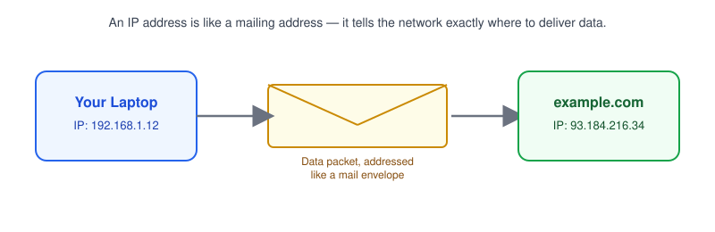
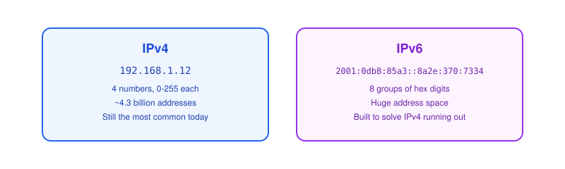
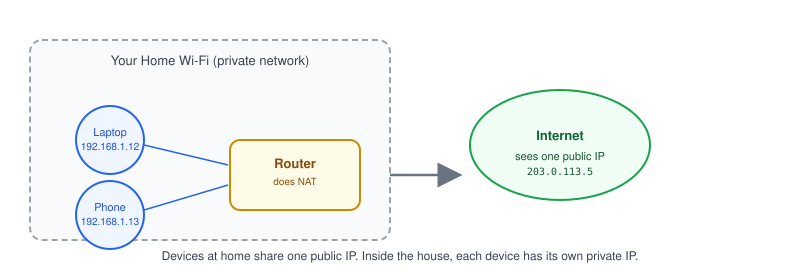
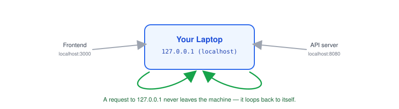

# Part 2: IP Address

## Table of Contents

- [1. What Is an IP Address?](#1-what-is-an-ip-address)
- [2. IPv4 vs. IPv6](#2-ipv4-vs-ipv6)
- [3. Public IP vs. Private IP](#3-public-ip-vs-private-ip)
- [4. Localhost and 127.0.0.1](#4-localhost-and-127001)
- [5. Special IP Addresses](#5-special-ip-addresses)
- [6. Real-World Example: Finding Your Own IP](#6-real-world-example-finding-your-own-ip)

---

## 1. What Is an IP Address?



An **IP address** (Internet Protocol address) is the number that identifies a device on a network, so data knows where to go.

- Every device that sends or receives data needs one — your laptop, your phone, the server hosting an API.
- It works like a mailing address: without it, a packet has no destination.

> **Note:** In [Part 1](../01-what-is-a-network), we said a client needs an address and a port to reach a server. This part covers that address; [Part 4](../04-ports) covers the port.

## 2. IPv4 vs. IPv6



| Version | Format                             | Example                               | Address space         |
| ------- | ----------------------------------- | -------------------------------------- | ---------------------- |
| IPv4    | 4 numbers (0-255), dot-separated    | `192.168.1.12`                         | ~4.3 billion addresses |
| IPv6    | 8 groups of hex digits, colon-separated | `2001:0db8:85a3::8a2e:370:7334`    | Practically unlimited   |

- **IPv4** is still what you'll see most often in day-to-day development.
- **IPv6** exists because the world ran out of IPv4 addresses to hand out.

> **Note:** If a `curl` or connection works with an IP but you're not sure which version, check for colons (`:`) — that's IPv6.

## 3. Public IP vs. Private IP



- **Private IP** — only reachable inside your local network (home Wi-Fi, office LAN). Common ranges: `192.168.x.x`, `10.x.x.x`, `172.16.x.x`–`172.31.x.x`.
- **Public IP** — reachable from the internet. Your router usually holds the single public IP for your whole home network.
- Your laptop and phone each get a private IP from the router; the router translates traffic between them and the internet ([NAT](../11-nat)).

> **Note:** "It works on my machine but not for my teammate" is often a private-vs-public IP mix-up — `192.168.1.12` only means something on *your* network.

## 4. Localhost and 127.0.0.1



- `127.0.0.1`, aka **localhost**, always points back to the machine you're on.
- It's how a frontend on `localhost:3000` can talk to a backend on `localhost:8080` without touching a real network.
- Nothing sent to `127.0.0.1` ever reaches another computer — even on the same Wi-Fi.

> **Note:** Running a backend in Docker and calling it from `localhost` can fail, because inside a container `localhost` means *the container itself*, not your host machine. More on this in [Part 17](../17-docker-networking).

## 5. Special IP Addresses

| Address           | Meaning                                              |
| ------------------ | ----------------------------------------------------- |
| `127.0.0.1`         | Localhost — loopback to the current machine           |
| `0.0.0.0`           | "All addresses on this machine" — used when a server should accept connections on every network interface |
| `255.255.255.255`   | Broadcast — send to every device on the local network |
| `169.254.x.x`       | Auto-assigned when a device fails to get an IP normally |

> **Note:** Starting a server with `app.listen(3000, '0.0.0.0')` instead of `'127.0.0.1'` is often what makes it reachable from outside a Docker container or VM.

## 6. Real-World Example: Finding Your Own IP

```bash
# Your private IP (Linux/macOS)
ipconfig getifaddr en0        # macOS Wi-Fi
ip addr show                  # Linux

# Your public IP
curl ifconfig.me
```

- The private IP is what your router assigned you on the local network.
- The public IP is what the rest of the internet sees — usually your router's address, shared by every device at home.

**Next up:** [Part 3 — MAC Address](../03-mac-address), where we cover how devices are identified on the local network itself, and how IP addresses get matched to hardware via ARP.
