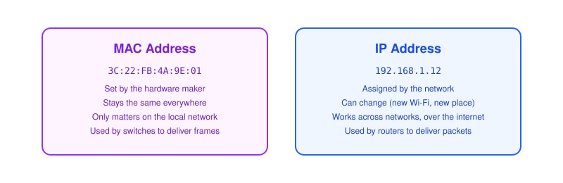
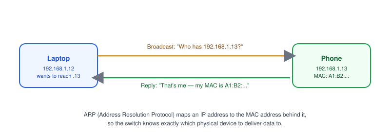

# Part 3: MAC Address

## Table of Contents

- [1. What Is a MAC Address?](#1-what-is-a-mac-address)
- [2. MAC vs. IP Address](#2-mac-vs-ip-address)
- [3. Why Devices Need Both](#3-why-devices-need-both)
- [4. ARP: Matching IP to MAC](#4-arp-matching-ip-to-mac)
- [5. Real-World Example: Viewing Your MAC Address](#5-real-world-example-viewing-your-mac-address)

---

## 1. What Is a MAC Address?


A **MAC address** (Media Access Control address) identifies a specific piece of network hardware — your Wi-Fi card, your Ethernet port.

- Written as six pairs of hex digits, e.g. `3C:22:FB:4A:9E:01`.
- Assigned by the hardware manufacturer and, unlike an [IP address](../02-ip-address), doesn't change when you switch networks.
- Only matters on the **local network** — it never travels across the internet.

## 2. MAC vs. IP Address



| Trait          | MAC Address                     | IP Address                          |
| -------------- | -------------------------------- | ------------------------------------ |
| Set by         | Hardware manufacturer            | The network (router/DHCP)            |
| Changes?        | Rarely                           | Often (new Wi-Fi, new location)      |
| Works across    | Local network only               | Local network and the internet       |
| Used by         | Switches, to deliver frames      | Routers, to deliver packets          |

> **Note:** Think of the IP address as the city and street on an envelope, and the MAC address as the exact person's name at the door — one gets you to the right building, the other gets it into the right hands.

## 3. Why Devices Need Both

- The **IP address** gets data to the right network and the right device on that network, potentially across the whole internet.
- The **MAC address** takes over for the last step — delivering data to the right physical device once it's on the same local network (handled by a [switch](../01-what-is-a-network)).
- Without a MAC address, a switch inside your home or office wouldn't know which port to send an incoming frame to.

## 4. ARP: Matching IP to MAC



**ARP (Address Resolution Protocol)** is how a device figures out the MAC address behind an IP address on the same network.

1. Your laptop wants to send data to `192.168.1.13` but only knows the IP.
2. It broadcasts: "Who has `192.168.1.13`?" to every device on the LAN.
3. The device with that IP replies with its MAC address.
4. Your laptop caches the result (its **ARP table**) so it doesn't have to ask again right away.

> **Note:** `arp -a` on macOS/Linux/Windows shows your device's current IP-to-MAC mappings — useful when debugging why a device on the LAN isn't reachable.

## 5. Real-World Example: Viewing Your MAC Address

```bash
# macOS
ifconfig en0 | grep ether

# Linux
ip link show

# Windows
ipconfig /all
```

- Look for a field labeled `ether` or `Physical Address` — that's your MAC address.
- Some operating systems now use **randomized MAC addresses** on Wi-Fi for privacy, so the address you see may change between networks even though the hardware is the same.

**Next up:** [Part 4 — Ports](../04-ports), where we cover how a single IP address can serve many different applications at once.
