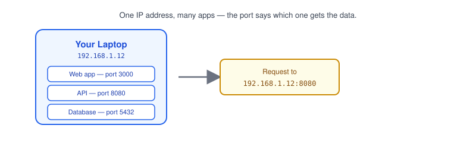
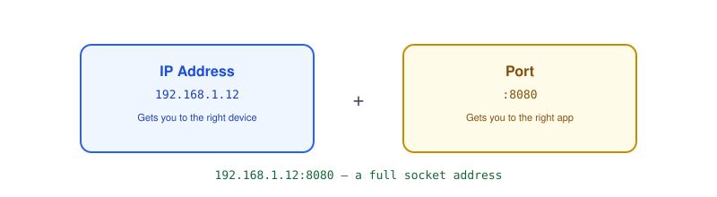
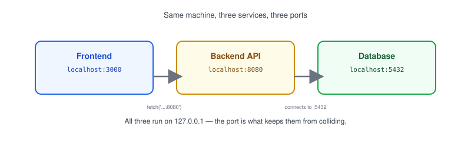

# Part 4: Ports

## Table of Contents

- [1. What Is a Port?](#1-what-is-a-port)
- [2. IP Address vs. Port](#2-ip-address-vs-port)
- [3. Common Ports](#3-common-ports)
- [4. Why Developers Need to Understand Ports](#4-why-developers-need-to-understand-ports)
- [5. Port Conflicts](#5-port-conflicts)

---

## 1. What Is a Port?



A **port** is a number that identifies a specific application running on a device, so data knows which app to go to — not just which device.

- A device's [IP address](../02-ip-address) gets data to the right machine.
- The **port** then gets it to the right *application* on that machine.
- Ports range from `0` to `65535`.

> **Note:** If an IP address is a building's street address, a port is the apartment number — the building alone doesn't tell the mail carrier which door to knock on.

## 2. IP Address vs. Port



- Together, an IP address and a port form a **socket address**, written as `IP:PORT` — e.g. `192.168.1.12:3000`.
- You've seen this in a browser URL: `http://localhost:8080` means "connect to `127.0.0.1`, on port `8080`."
- One device can run many applications at once, each on its own port, all sharing the same IP address.

## 3. Common Ports

| Port | Used for            |
| ---- | -------------------- |
| 80   | HTTP                 |
| 443  | HTTPS                |
| 22   | SSH                  |
| 53   | DNS                  |
| 5432 | PostgreSQL           |
| 3306 | MySQL                |

- Ports below `1024` are called **well-known ports** and are reserved for common services like HTTP and SSH.
- Most apps you build in development pick a port above `1024`, like `3000` or `8080`, to avoid needing special permissions.

> **Note:** [Part 6](../06-http-https) and [Part 15](../15-reverse-proxy) cover ports 80 and 443 in more depth — that's where HTTP and HTTPS traffic normally arrives.

## 4. Why Developers Need to Understand Ports



- Local development often runs several services at once on the same machine — a frontend, a backend, a database — each needing its own port.
- Your frontend calling `fetch('http://localhost:8080/api')` is telling the browser exactly which app to talk to on your machine.
- Misconfigured ports are a common source of **"connection refused"** errors — the IP is reachable, but nothing is listening on that specific port.

## 5. Port Conflicts

- A **port conflict** happens when two applications try to listen on the same port at the same time.
- The second app usually fails to start, with an error like `EADDRINUSE: address already in use`.
- To find what's using a port:

```bash
# macOS/Linux
lsof -i :3000

# Linux (alternative)
ss -tulpn | grep 3000

# Windows
netstat -ano | findstr :3000
```

> **Note:** Killing the process using a port (`kill -9 <PID>`) is a quick fix locally, but if it keeps happening, it usually means an old server instance didn't shut down cleanly.

**Next up:** [Part 5 — TCP vs. UDP](../05-tcp-vs-udp), where we cover how data actually travels once it reaches the right IP address and port.
