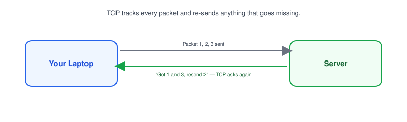
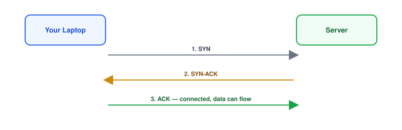
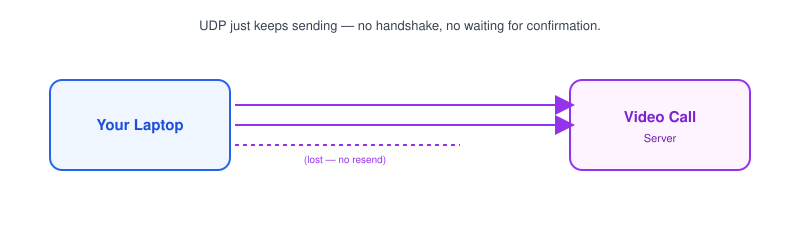

# Part 5: TCP vs. UDP

## Table of Contents

- [1. What Is TCP?](#1-what-is-tcp)
- [2. The TCP 3-Way Handshake](#2-the-tcp-3-way-handshake)
- [3. What Is UDP?](#3-what-is-udp)
- [4. TCP vs. UDP](#4-tcp-vs-udp)
- [5. Real-World Examples](#5-real-world-examples)

---

## 1. What Is TCP?

**TCP (Transmission Control Protocol)** is a way of sending data across a network that guarantees it arrives complete and in order.

- Before any data is sent, TCP sets up a **connection** between the two sides.
- Every piece of data is tracked — if something goes missing, TCP asks for it again.
- This reliability comes at a small cost in speed, since confirming delivery takes extra round trips.

> **Note:** When you load a webpage or call a REST API, you're using TCP — [HTTP](../06-http-https) runs on top of it.

## 2. The TCP 3-Way Handshake

Before sending any real data, TCP connects the two sides with a **3-way handshake**:

1. **SYN** — your laptop says "I'd like to connect."
2. **SYN-ACK** — the server replies "okay, and I'd like to connect too."
3. **ACK** — your laptop confirms "confirmed, let's go."

- Only after this handshake does actual data start flowing.
- This is also why a TCP connection has a tiny bit of delay before the "real" request even begins.

> **Note:** A `curl` command that hangs before showing any response is often stuck at this handshake step — the server isn't responding to the initial `SYN`.

## 3. What Is UDP?

**UDP (User Datagram Protocol)** sends data without setting up a connection first, and without checking that it arrived.

- No handshake, no delivery confirmation, no automatic re-sending of lost data.
- Much faster than TCP, because there's no waiting around for acknowledgments.
- If a packet gets lost, UDP simply doesn't know — and doesn't care.

## 4. TCP vs. UDP

| Trait          | TCP                              | UDP                              |
| -------------- | ---------------------------------- | ----------------------------------- |
| Connection      | Set up first (handshake)          | None — just sends                   |
| Reliability     | Guaranteed delivery, in order      | No guarantee, no ordering           |
| Speed           | Slower (overhead from tracking)    | Faster (no tracking)                |
| Used for        | Web pages, APIs, file transfer     | Video calls, live streaming, gaming |

> **Note:** Think of TCP as a phone call where you confirm "can you hear me?" and UDP as shouting across a room — faster, but you don't know if it landed.

## 5. Real-World Examples

- **TCP:** loading a website, calling a REST API, sending an email, downloading a file — anywhere missing data would break things.
- **UDP:** video calls, live streaming, online games, DNS lookups ([Part 7](../07-dns)) — anywhere a little bit of lost data is better than waiting for it to be resent.
- A video call dropping a frame is barely noticeable; an API response missing half its JSON would be broken — that difference is why each protocol exists.

**Next up:** [Part 6 — HTTP & HTTPS](../06-http-https), where we cover the protocol built on top of TCP that powers almost every web request you make.
