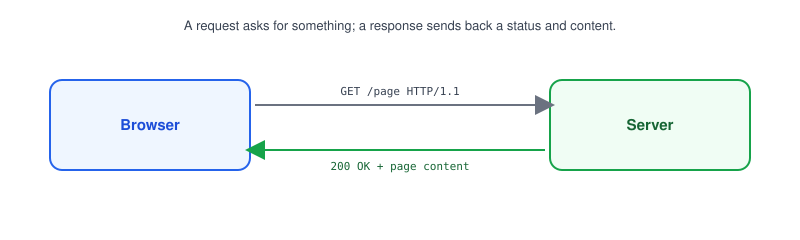
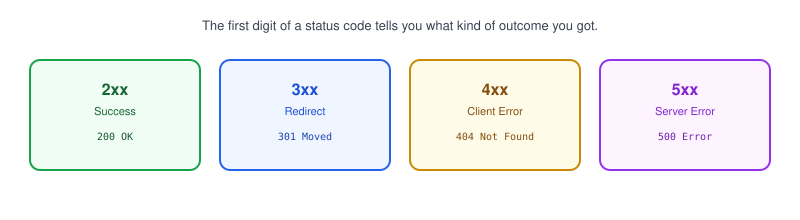
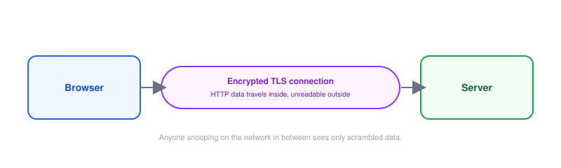

# Part 6: HTTP & HTTPS

## Table of Contents

- [1. What Is HTTP?](#1-what-is-http)
- [2. HTTP Methods](#2-http-methods)
- [3. HTTP Status Codes](#3-http-status-codes)
- [4. Headers](#4-headers)
- [5. HTTPS and TLS](#5-https-and-tls)
- [6. What Happens When You Visit https://example.com](#6-what-happens-when-you-visit-httpsexamplecom)

---

## 1. What Is HTTP?



**HTTP (HyperText Transfer Protocol)** is the request/response language browsers and servers use to talk to each other, running on top of [TCP](../05-tcp-vs-udp).

- Your browser sends a **request**: "give me this page" or "save this form data."
- The server sends back a **response**: the page content, plus a status telling you whether it worked.
- Every API call, page load, and image fetch on the web is an HTTP request/response pair.

## 2. HTTP Methods

| Method | Used for                          |
| ------ | ----------------------------------- |
| GET    | Fetching data, no changes made      |
| POST   | Creating something new              |
| PUT    | Replacing an existing resource      |
| PATCH  | Partially updating a resource       |
| DELETE | Removing a resource                 |

- The **method** tells the server what kind of action the request wants to perform.
- `GET` is what your browser sends every time you load a webpage.

> **Note:** A `curl -X POST` command explicitly sets the method — without `-X`, `curl` defaults to `GET`.

## 3. HTTP Status Codes



| Range | Meaning         | Example                        |
| ----- | ---------------- | -------------------------------- |
| 2xx   | Success           | `200 OK`, `201 Created`          |
| 3xx   | Redirect          | `301 Moved Permanently`          |
| 4xx   | Client error      | `404 Not Found`, `401 Unauthorized` |
| 5xx   | Server error      | `500 Internal Server Error`      |

> **Note:** A `404` means your request reached the server fine, but the thing you asked for doesn't exist — that's different from a connection error, where the request never got there at all.

## 4. Headers

- **Headers** are extra metadata sent along with a request or response — not the actual content, but information about it.
- Common request headers: `Content-Type` (what format the body is in), `Authorization` (credentials), `User-Agent` (what client is asking).
- Common response headers: `Content-Type`, `Set-Cookie`, `Cache-Control`.

```bash
curl -i https://example.com
# -i prints the response headers along with the body
```

## 5. HTTPS and TLS



**HTTPS** is HTTP sent over an encrypted connection, using **TLS (Transport Layer Security)**.

- Without HTTPS, anyone on the same network could read (or alter) your data as it travels — including passwords and form data.
- HTTPS encrypts the connection itself, so data traveling between browser and server is unreadable to anyone in between.
- Browsers show a padlock icon when a connection is HTTPS; sites without it are marked "Not Secure."

| Trait          | HTTP                    | HTTPS                        |
| -------------- | ------------------------ | ------------------------------ |
| Encrypted?      | No                       | Yes (via TLS)                 |
| Default port    | 80                       | 443                           |
| Data visible to network eavesdroppers | Yes | No |

> **Note:** [Part 15](../15-reverse-proxy) covers **TLS termination** — where a reverse proxy handles the HTTPS encryption/decryption in front of your app.

## 6. What Happens When You Visit https://example.com

1. Your browser looks up `example.com`'s IP address via [DNS](../07-dns).
2. It opens a [TCP connection](../05-tcp-vs-udp) to that IP on port `443`.
3. Browser and server perform a **TLS handshake** to set up encryption.
4. The browser sends an HTTP `GET /` request over that encrypted connection.
5. The server responds with a status code and the page content.

**Next up:** [Part 7 — DNS](../07-dns), where we cover how a domain name like `example.com` gets turned into an IP address in the first place.
