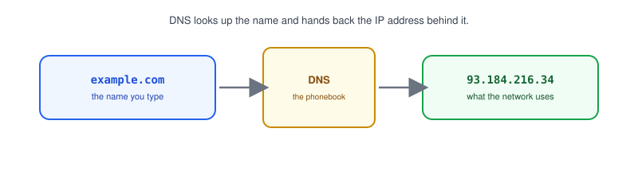
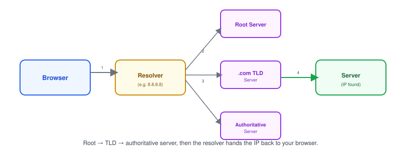

# Part 7: DNS

## Table of Contents

- [1. What Is DNS?](#1-what-is-dns)
- [2. Domain Name vs. IP Address](#2-domain-name-vs-ip-address)
- [3. How DNS Resolution Works](#3-how-dns-resolution-works)
- [4. DNS Record Types](#4-dns-record-types)
- [5. DNS Caching](#5-dns-caching)
- [6. Real-World Example: Looking Up DNS Records](#6-real-world-example-looking-up-dns-records)

---

## 1. What Is DNS?



**DNS (Domain Name System)** turns human-friendly domain names into the [IP addresses](../02-ip-address) computers actually use to connect.

- Computers route traffic using IP addresses, not names like `example.com`.
- DNS is essentially the internet's phonebook: you look up a name, you get back a number.
- Without DNS, you'd have to memorize an IP address for every website you visit.

## 2. Domain Name vs. IP Address

| Trait          | Domain Name              | IP Address                |
| -------------- | -------------------------- | ---------------------------- |
| Example         | `example.com`              | `93.184.216.34`               |
| Easy for humans? | Yes                        | Not really                    |
| Used by computers to connect? | No, needs resolving first | Yes, directly |
| Can change?      | Rarely (you own it)        | Sometimes (server migrates)   |

> **Note:** A domain name can point to a different IP address over time — that's exactly what DNS makes possible without you needing to update any links.

## 3. How DNS Resolution Works



1. Your browser asks a **DNS resolver** (often run by your ISP or a public one like `8.8.8.8`) to look up `example.com`.
2. The resolver asks a **root server**, which points it to the `.com` **TLD server**.
3. The TLD server points it to `example.com`'s **authoritative server**.
4. The authoritative server replies with the actual IP address.
5. The resolver hands that IP back to your browser, which connects directly.

> **Note:** This whole lookup usually happens in milliseconds and is invisible — you only notice it when it's slow or broken (a `DNS_PROBE_FINISHED` error in a browser).

## 4. DNS Record Types

| Record | Purpose                                      |
| ------ | ---------------------------------------------- |
| A      | Maps a domain to an IPv4 address                |
| AAAA   | Maps a domain to an IPv6 address                |
| CNAME  | Aliases one domain name to another               |
| MX     | Points a domain to its email server              |
| TXT    | Holds arbitrary text, often for verification     |

- Most web traffic depends on **A** or **AAAA** records to find a server.
- **CNAME** is common for pointing a subdomain (like `www`) at another domain without duplicating the IP.

## 5. DNS Caching

- DNS answers are **cached** at multiple levels — your browser, your OS, your router, your ISP's resolver — so lookups don't repeat every time.
- Each record has a **TTL (Time To Live)**, telling caches how long to keep the answer before asking again.
- A short TTL means changes propagate fast but lookups happen more often; a long TTL is more efficient but changes take longer to show up everywhere.

> **Note:** If you just updated a domain's IP and it's still showing the old server, DNS caching (not a broken deploy) is the usual culprit — worth checking before debugging further.

## 6. Real-World Example: Looking Up DNS Records

```bash
# Look up the A record for a domain
nslookup example.com

# More detailed lookup (Linux/macOS)
dig example.com
```

- `nslookup` and `dig` both query DNS directly and show you the IP address a domain resolves to.
- These are the first tools to reach for when a site "won't load" but the server itself seems fine — they tell you whether the domain is resolving correctly at all.

**Next up:** [Part 8 — OSI & TCP/IP Models](../08-osi-and-tcpip-models), where we step back and see how everything covered so far — IP, MAC, ports, TCP/UDP, HTTP, DNS — fits together in layers.
