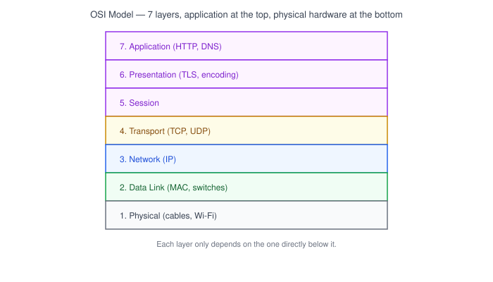
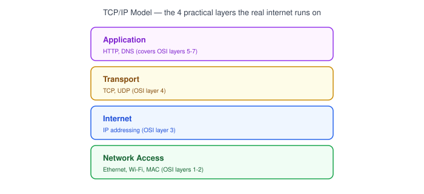
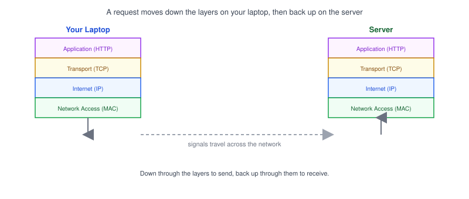

# Part 8: OSI & TCP/IP Models

## Table of Contents

- [1. Why Network Models Exist](#1-why-network-models-exist)
- [2. The OSI 7-Layer Model](#2-the-osi-7-layer-model)
- [3. The TCP/IP Model](#3-the-tcpip-model)
- [4. How a Web Request Travels Through the Layers](#4-how-a-web-request-travels-through-the-layers)
- [5. A Practical Developer Perspective](#5-a-practical-developer-perspective)

---

## 1. Why Network Models Exist

Everything covered in Parts 1–7 — IP addresses, MAC addresses, ports, TCP/UDP, HTTP, DNS — fits into a bigger picture: a stack of **layers**, each responsible for one part of getting data from one device to another.

- Splitting networking into layers means each layer only needs to worry about its own job.
- Your app code doesn't need to know how Wi-Fi radio signals work, and the Wi-Fi hardware doesn't need to know what an HTTP request is — layers hide that complexity from each other.
- Two models describe this stack: the theoretical **OSI model** (7 layers) and the practical **TCP/IP model** (4 layers) that the real internet actually runs on.

## 2. The OSI 7-Layer Model

| Layer | Name         | Example                          |
| ----- | ------------- | ----------------------------------- |
| 7     | Application   | HTTP, DNS — what your app talks     |
| 6     | Presentation  | Encryption, data formatting (TLS)   |
| 5     | Session       | Managing a connection session       |
| 4     | Transport     | TCP, UDP — [Part 5](../05-tcp-vs-udp) |
| 3     | Network       | IP addressing, routing — [Part 2](../02-ip-address) |
| 2     | Data Link     | MAC addresses, switches — [Part 3](../03-mac-address) |
| 1     | Physical      | Cables, Wi-Fi radio signals          |

> **Note:** OSI is mostly a teaching and reference model — you rarely map real traffic to all 7 layers in day-to-day development, but the layer names (like "Layer 4" or "Layer 7") show up constantly in tools like load balancers ([Part 16](../16-load-balancer)).

## 3. The TCP/IP Model

| TCP/IP Layer   | Roughly maps to OSI layers | Example                     |
| --------------- | ---------------------------- | ------------------------------ |
| Application      | 5, 6, 7                     | HTTP, DNS                     |
| Transport         | 4                            | TCP, UDP                      |
| Internet           | 3                            | IP                             |
| Network Access     | 1, 2                          | Ethernet, Wi-Fi, MAC addresses |

- The **TCP/IP model** is what the real-world internet is actually built on — OSI is more of a reference for talking about it.
- It condenses OSI's 7 layers into 4, merging the top three (application-level concerns) into one layer.

## 4. How a Web Request Travels Through the Layers

1. **Application** — your browser builds an HTTP request.
2. **Transport** — TCP breaks it into packets and tracks delivery ([Part 5](../05-tcp-vs-udp)).
3. **Internet** — each packet gets an IP address for source and destination ([Part 2](../02-ip-address)).
4. **Network Access** — the packet becomes electrical/radio signals on the wire or Wi-Fi, addressed to a MAC address on the local network ([Part 3](../03-mac-address)).
5. On the server, the same layers unwrap in reverse — signals become bits, bits become packets, packets become the HTTP request the server actually handles.

## 5. A Practical Developer Perspective

- You'll rarely touch Layers 1–2 directly — that's handled by your OS and network hardware.
- Most day-to-day development lives at the **Application** and **Transport** layers: writing HTTP requests, picking TCP vs UDP, choosing ports.
- Terms like "Layer 4 load balancer" or "Layer 7 routing" ([Part 16](../16-load-balancer)) refer directly back to this model — knowing the layers makes that vocabulary click into place.

**Next up:** [Part 9 — Subnet & CIDR Basics](../09-subnet-and-cidr-basics), which starts Level 2 — practical networking concepts developers run into with cloud infrastructure and Docker.
