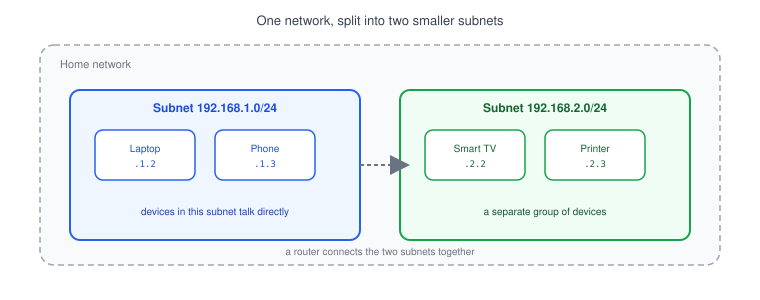
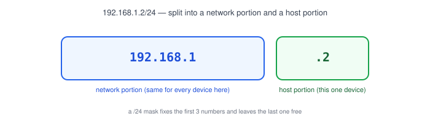
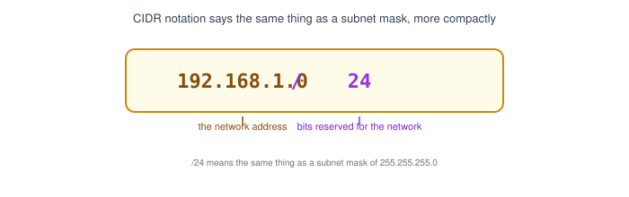

# Part 9: Subnet & CIDR Basics

## Table of Contents

- [1. What Is a Subnet?](#1-what-is-a-subnet)
- [2. Network Portion vs. Host Portion](#2-network-portion-vs-host-portion)
- [3. The Subnet Mask](#3-the-subnet-mask)
- [4. CIDR Notation](#4-cidr-notation)
- [5. Common CIDR Blocks](#5-common-cidr-blocks)
- [6. Why Developers Should Care About CIDR](#6-why-developers-should-care-about-cidr)

---

## 1. What Is a Subnet?

A **subnet** (short for sub-network) is a smaller network carved out of a bigger one. Instead of every device sharing one flat address space, a network gets split into separate chunks.

- Your home Wi-Fi is already a subnet — your laptop and phone share addresses like `192.168.1.2` and `192.168.1.3` inside the range `192.168.1.0/24`.
- Cloud providers (AWS, GCP, Azure) and tools like Docker use subnets to group and isolate resources, even when you never see the word "subnet" directly.
- Splitting a network into subnets keeps related devices together and keeps unrelated traffic apart.

## 2. Network Portion vs. Host Portion

Every [IP address](../02-ip-address) in a subnet is really two parts glued together:

- The **network portion** — identifies which subnet the address belongs to. It's the same for every device on that subnet.
- The **host portion** — identifies one specific device within that subnet.

For `192.168.1.2/24`, `192.168.1` is the network portion and `2` is the host portion — every device on this subnet shares `192.168.1.x`, with `x` being what makes each one unique.

## 3. The Subnet Mask

A **subnet mask** tells a device where the network portion ends and the host portion begins. It's written like an IP address, but its job is to act as a filter.

| Subnet Mask       | Meaning                                  |
| ------------------ | ------------------------------------------ |
| `255.255.255.0`     | First 3 numbers = network, last number = hosts |
| `255.255.0.0`       | First 2 numbers = network, last 2 = hosts       |
| `255.0.0.0`         | First number = network, last 3 = hosts          |

> **Note:** A `255` in the mask means "this part is fixed (network)"; a `0` means "this part can vary (hosts)." `255.255.255.0` is by far the most common mask you'll see on a small network like a home or a single Docker network.

## 4. CIDR Notation

**CIDR (Classless Inter-Domain Routing)** notation is a shorthand for a subnet mask. Instead of writing out `255.255.255.0`, you write `/24` — the number after the slash counts how many bits (out of 32) are fixed as the network portion.

- `192.168.1.0/24` means: the first 24 bits are the network, the remaining 8 bits are for hosts.
- 8 bits of host space = 256 possible addresses (`0`–`255`), so `/24` fits up to 254 usable devices (2 addresses are reserved — more on that below).
- A smaller number after the slash means a **bigger** network; a bigger number means a **smaller** network.

## 5. Common CIDR Blocks

| CIDR   | Subnet Mask       | Usable Hosts | Typical Use                     |
| ------ | ------------------ | ------------- | ---------------------------------- |
| `/32`  | `255.255.255.255`   | 1              | A single device (no host range)     |
| `/24`  | `255.255.255.0`     | 254            | A home network or one Docker network |
| `/16`  | `255.255.0.0`       | 65,534         | A large private network or VPC      |
| `/8`   | `255.0.0.0`         | 16,777,214     | An entire class of private addresses |

> **Note:** `10.0.0.0/8`, `172.16.0.0/12`, and `192.168.0.0/16` are the [private address](../02-ip-address) ranges reserved for internal networks — you'll see these exact ranges again when working with cloud VPCs and Docker networks.

## 6. Why Developers Should Care About CIDR

- **Cloud networking** — when you create a VPC on AWS or GCP, you're asked to pick a CIDR block (e.g. `10.0.0.0/16`) that defines how many resources can live inside it.
- **Docker** — every Docker network is assigned a CIDR range under the hood (often something like `172.17.0.0/16`), which is why container IPs usually start with `172.17.x.x`.
- **Debugging "can this reach that?"** — many connectivity issues come down to two things being on different subnets that were never told how to route between each other. Recognizing a CIDR block tells you instantly how big a network is and what addresses belong to it.

**Next up:** [Part 10 — Routing](../10-routing), where we look at how traffic actually gets from one subnet to another.
