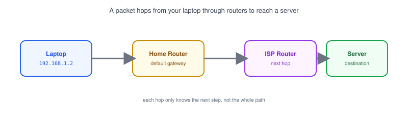
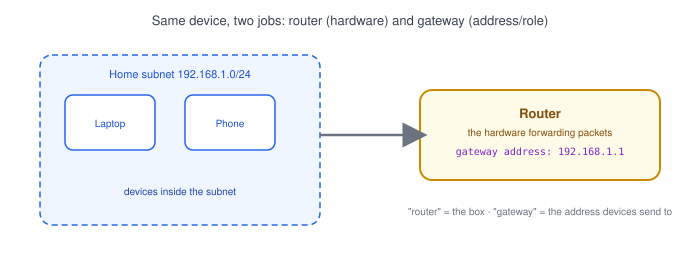
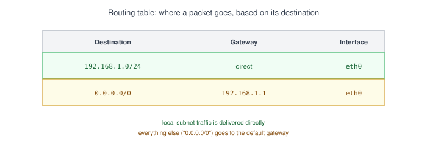

# Part 10: Routing

## Table of Contents

- [1. What Is Routing?](#1-what-is-routing)
- [2. Router vs. Gateway](#2-router-vs-gateway)
- [3. The Default Gateway](#3-the-default-gateway)
- [4. The Routing Table](#4-the-routing-table)
- [5. How a Packet Finds Its Destination](#5-how-a-packet-finds-its-destination)
- [6. Real-World Example: Reading Your Routing Table](#6-real-world-example-reading-your-routing-table)

---

## 1. What Is Routing?



**Routing** is the process of moving a packet from where it starts to where it needs to go, often through several devices in between.

- Your laptop can't reach a server on the internet directly — it doesn't know how. It just hands the packet to a device that does.
- Each hop along the way looks at the packet's destination [IP address](../02-ip-address) and forwards it one step closer.
- This happens for every request you make — loading a website, calling an API — usually in a few milliseconds.

## 2. Router vs. Gateway



These two words get used interchangeably, but they mean slightly different things:

| Term        | What it means                                                        |
| ----------- | ------------------------------------------------------------------------ |
| **Router**   | The physical (or virtual) device that forwards packets between networks |
| **Gateway**  | The *role* a device plays — the exit point a [subnet](../09-subnet-and-cidr-basics) uses to reach anywhere outside itself |

- On your home network, your router and your gateway are usually the same device — it forwards packets, and it's also the address your laptop sends outbound traffic to.
- "Gateway" is really an address (like `192.168.1.1`); "router" is the hardware doing the forwarding.

## 3. The Default Gateway

The **default gateway** is the address a device sends a packet to when it doesn't already know a more specific route.

- If your laptop is `192.168.1.2/24` and it wants to reach `93.184.216.34` (outside its own subnet), it can't send the packet directly — that address isn't on the local network.
- Instead, it hands the packet to its default gateway (commonly `192.168.1.1`), and lets the router figure out the next hop.
- Almost all outbound internet traffic from a home or office device goes through its default gateway first.

## 4. The Routing Table



Every device — and every router — keeps a **routing table**: a list of rules for where to send packets based on their destination.

| Destination        | Gateway         | Interface | Meaning                          |
| ------------------- | ----------------- | ----------- | ------------------------------------ |
| `192.168.1.0/24`     | direct (no hop)    | `eth0`       | Local subnet — deliver directly       |
| `0.0.0.0/0`          | `192.168.1.1`      | `eth0`       | Everything else — send to the gateway |

> **Note:** `0.0.0.0/0` is the "match anything" route — it's how a routing table expresses "if nothing more specific matched, send it to the default gateway."

## 5. How a Packet Finds Its Destination

1. A device checks its routing table for the packet's destination address.
2. If the destination is on the same subnet, it's delivered directly — no router needed.
3. If not, the packet goes to the default gateway.
4. That router checks its own routing table and forwards the packet to the next router closer to the destination.
5. This repeats, hop by hop, until the packet reaches a router that can deliver it directly to the destination network.

## 6. Real-World Example: Reading Your Routing Table

```bash
# View the routing table (Linux)
ip route

# View the routing table (macOS/older Linux)
route -n

# View the routing table (Windows)
route print
```

- The line marked `default` (or `0.0.0.0/0`) shows your default gateway — the address your device relies on for anything outside your local subnet.
- If a server "can't be reached" but DNS and the server itself are both fine, a missing or wrong route is one of the things worth checking next.

**Next up:** [Part 11 — NAT](../11-nat), where we cover how a whole home network shares one public IP address to reach the internet.
