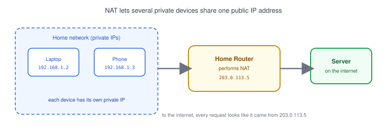
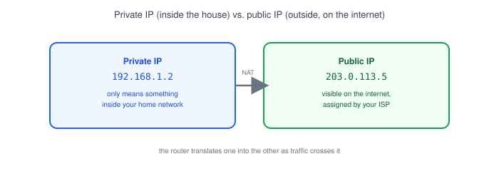
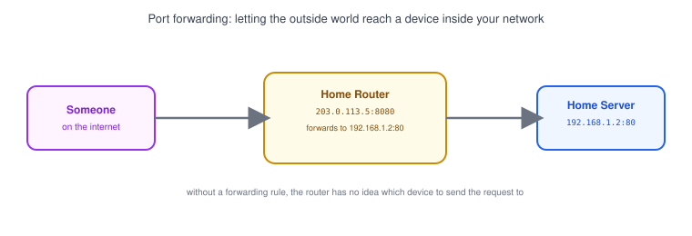

# Part 11: NAT

## Table of Contents

- [1. What Is NAT?](#1-what-is-nat)
- [2. Private IP vs. Public IP](#2-private-ip-vs-public-ip)
- [3. Why Home Networks Use NAT](#3-why-home-networks-use-nat)
- [4. Port Forwarding](#4-port-forwarding)
- [5. How NAT Affects Application Development](#5-how-nat-affects-application-development)

---

## 1. What Is NAT?

**NAT (Network Address Translation)** lets many devices on a private network share a single public [IP address](../02-ip-address) when talking to the internet.

- Your laptop and phone each have their own private IP at home, but neither is reachable directly from the internet.
- Your router sits in between, swapping each device's private IP for its own public IP on the way out — and swapping it back on the way in.
- From the outside, every request from your home looks like it came from one address: your router's public IP.

## 2. Private IP vs. Public IP

| Type            | Example         | Where it's valid                          |
| ---------------- | ----------------- | -------------------------------------------- |
| **Private IP**    | `192.168.1.2`      | Only inside your own network                  |
| **Public IP**     | `203.0.113.5`      | Visible and routable on the internet          |

- Private IP ranges (like `192.168.0.0/16`, `10.0.0.0/8`) are reserved — anyone can reuse them inside their own network without conflict.
- Public IPs must be globally unique, which is part of why they're a limited resource. See [Part 2](../02-ip-address) for the full public-vs-private breakdown.

## 3. Why Home Networks Use NAT

- ISPs typically hand out **one public IP per household or office**, not one per device.
- NAT lets every laptop, phone, smart TV, and printer on that network share the single public IP for outbound internet access.
- It also adds a side effect of privacy/security: devices behind NAT aren't directly reachable from the internet unless something explicitly opens a path in.

> **Note:** NAT is not a firewall, but it has a firewall-like effect — unsolicited inbound traffic has nowhere to go, because the router doesn't know which private device it belongs to.

## 4. Port Forwarding

**Port forwarding** is how you deliberately punch a hole through NAT — telling the router "anything that arrives on this public port should go to this specific device."

- Example: forward `203.0.113.5:8080` → `192.168.1.2:80`, so anyone visiting your public IP on port 8080 reaches the web server running on your laptop's port 80.
- Without a forwarding rule, the router has no way to know which of your devices an unsolicited inbound request is meant for, so it drops it.
- This is the same idea used when self-hosting something at home, or when a cloud provider maps a public [port](../04-ports) to a private instance.

## 5. How NAT Affects Application Development

- **Local development is invisible from outside.** Running a server on `localhost:3000` or your private IP won't be reachable by a teammate on another network — NAT (and your firewall) block it by default.
- **"It works on my machine" for networking often means NAT.** Two devices on the same home Wi-Fi can reach each other by private IP; the moment one of them is elsewhere on the internet, that private IP means nothing.
- **Tools like ngrok exist because of NAT.** They create a public URL that tunnels back to a private, NAT'd machine — useful for testing webhooks or sharing a local server without configuring port forwarding.
- **Cloud servers usually skip this problem.** A VM in the cloud is typically given a public IP directly (or sits behind a load balancer with one), which is part of why deploying "just works" compared to hosting from home.

**Next up:** [Part 12 — Firewall](../12-firewall), where we cover how devices decide which traffic to allow in and out in the first place.
