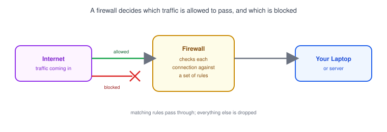
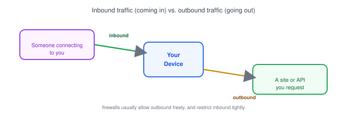
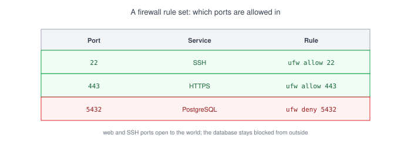

# Part 12: Firewall

## Table of Contents

- [1. What Is a Firewall?](#1-what-is-a-firewall)
- [2. Inbound vs. Outbound Traffic](#2-inbound-vs-outbound-traffic)
- [3. Allowing and Blocking Ports](#3-allowing-and-blocking-ports)
- [4. Basic Firewall Tools: ufw](#4-basic-firewall-tools-ufw)
- [5. Common Connection Problems Caused by Firewalls](#5-common-connection-problems-caused-by-firewalls)

---

## 1. What Is a Firewall?



A **firewall** is a set of rules that decides which network traffic is allowed to pass, and which gets blocked.

- It sits between your device (or server) and the network, inspecting each connection attempt.
- A rule usually matches on things like [port](../04-ports) number, protocol, and source address.
- Traffic that matches an "allow" rule passes through; everything else is dropped silently or rejected.

## 2. Inbound vs. Outbound Traffic



| Direction     | Meaning                                      | Typical default          |
| -------------- | ------------------------------------------------ | ---------------------------- |
| **Inbound**     | Traffic coming *into* your device from outside    | Blocked unless explicitly allowed |
| **Outbound**    | Traffic your device sends *out* to somewhere else | Usually allowed freely        |

- When you `curl` an API or your browser loads a page, that's outbound — your firewall almost never blocks it.
- When someone tries to connect to a server you're running, that's inbound — this is where firewall rules matter most.

## 3. Allowing and Blocking Ports



Firewall rules are commonly written per-port:

- Allow `22` (SSH) so you can manage the server remotely.
- Allow `443` (HTTPS) so visitors can reach your web app.
- Block `5432` (PostgreSQL) or `3306` (MySQL) from the outside — a database should only be reachable from your app server, not the whole internet.

> **Note:** "The port is open on my app" and "the firewall allows that port" are two different things. Your app can be listening perfectly fine and still be unreachable if the firewall in front of it blocks that port.

## 4. Basic Firewall Tools: ufw

`ufw` (**U**ncomplicated **F**ire**w**all) is a common command-line firewall tool on Ubuntu/Linux servers:

```bash
# check current status and rules
sudo ufw status

# allow a specific port
sudo ufw allow 443

# allow a specific port and protocol
sudo ufw allow 22/tcp

# block a port
sudo ufw deny 5432

# enable the firewall
sudo ufw enable
```

- Rules are evaluated in order, and `ufw` gives you a simple allow/deny interface over Linux's more complex underlying firewall system.
- Cloud providers often layer their own firewall (security groups, in AWS terms) in front of the server's own `ufw` rules — both have to allow the traffic for it to get through.

## 5. Common Connection Problems Caused by Firewalls

- **"Connection timed out"** when calling an API or connecting to a database often means a firewall is silently dropping the traffic, rather than actively rejecting it.
- **A newly deployed app is unreachable** even though it's running — check whether the server's firewall (and any cloud-level firewall) allows the port your app listens on.
- **SSH suddenly stops working** after tightening firewall rules — always keep port `22` allowed *before* enabling `ufw`, or you can lock yourself out of a remote server.
- **A database "can't connect" from your local machine** but works fine from the app server — this is usually the firewall correctly blocking direct public access to the database, which is the secure setup you want.

**Next up:** [Part 13 — Network Tools for Developers](../13-network-tools-for-developers), where we cover the CLI tools you'll actually reach for to debug problems like these.
