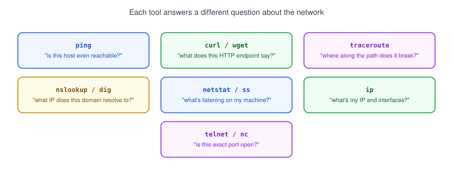
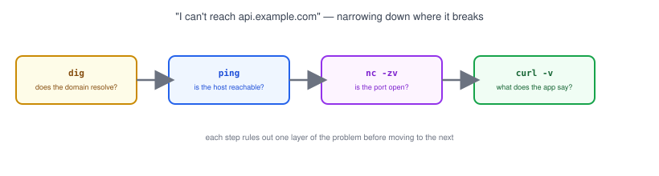

# Part 13: Network Tools for Developers

## Table of Contents

- [1. Your Networking Toolbox](#1-your-networking-toolbox)
- [2. ping — Is the Host Reachable?](#2-ping--is-the-host-reachable)
- [3. curl & wget — Making HTTP Requests](#3-curl--wget--making-http-requests)
- [4. traceroute — Tracing the Path](#4-traceroute--tracing-the-path)
- [5. nslookup & dig — DNS Lookups](#5-nslookup--dig--dns-lookups)
- [6. netstat & ss — What's Listening on My Machine?](#6-netstat--ss--whats-listening-on-my-machine)
- [7. ip — Inspecting Network Interfaces](#7-ip--inspecting-network-interfaces)
- [8. telnet & nc — Testing Raw TCP Connections](#8-telnet--nc--testing-raw-tcp-connections)
- [9. Putting It Together: A Troubleshooting Walkthrough](#9-putting-it-together-a-troubleshooting-walkthrough)

---

## 1. Your Networking Toolbox



Every tool in this part answers a narrow question. Knowing which one to reach for is most of the battle when something "isn't connecting."

## 2. ping — Is the Host Reachable?

```bash
ping -c 4 google.com
```

```
PING google.com (142.250.80.14): 56 data bytes
64 bytes from 142.250.80.14: icmp_seq=0 ttl=117 time=12.4 ms
64 bytes from 142.250.80.14: icmp_seq=1 ttl=117 time=11.8 ms
64 bytes from 142.250.80.14: icmp_seq=2 ttl=117 time=13.1 ms
64 bytes from 142.250.80.14: icmp_seq=3 ttl=117 time=12.0 ms

--- google.com ping statistics ---
4 packets transmitted, 4 packets received, 0.0% packet loss
```

- `ping` sends small packets and waits for a reply — it tells you if a host is up and roughly how far away it is (`time=`).
- `100% packet loss` usually means a firewall (see [Part 12](../12-firewall)) is blocking it, or the host is genuinely unreachable.
- `-c 4` limits it to 4 pings; without it, `ping` keeps running until you stop it with `Ctrl+C`.

## 3. curl & wget — Making HTTP Requests

```bash
# fetch a URL and print response headers + body status
curl -i https://api.github.com

# just check the status code
curl -o /dev/null -s -w "%{http_code}\n" https://api.github.com

# download a file
wget https://example.com/file.zip
```

```
HTTP/2 200
server: GitHub.com
content-type: application/json; charset=utf-8
...
```

- `curl` is the go-to tool for testing an [HTTP](../06-http-and-https) endpoint the same way your app would call it — headers, status codes, response body, all visible.
- `wget` is simpler and built for downloading files straight to disk.
- `curl -v` (verbose) shows the full request/response exchange, including the TLS handshake — useful when HTTPS itself is the problem.

## 4. traceroute — Tracing the Path

```bash
traceroute google.com
```

```
 1  192.168.1.1 (192.168.1.1)  1.123 ms
 2  10.10.0.1 (10.10.0.1)  8.501 ms
 3  203.0.113.1 (203.0.113.1)  12.847 ms
 4  142.250.80.14 (142.250.80.14)  13.204 ms
```

- `traceroute` (or `tracert` on Windows) shows every [router hop](../10-routing) between you and the destination.
- If it stops responding partway through, that's roughly where the connection is breaking — useful for telling "my network" apart from "their network" apart from "the internet in between."

## 5. nslookup & dig — DNS Lookups

```bash
nslookup example.com

dig example.com

# just the answer, nothing else
dig +short example.com
```

```
;; ANSWER SECTION:
example.com.        86400   IN      A       93.184.216.34
```

- Both tools query [DNS](../07-dns) and show what IP address a domain resolves to.
- `dig` gives more detail (TTL, record type, the full response) and is generally preferred by developers; `nslookup` is more widely available out of the box.
- A `NXDOMAIN` or empty answer means the domain isn't resolving at all — check the DNS record before assuming the server is down.

## 6. netstat & ss — What's Listening on My Machine?

```bash
# older, widely available
netstat -tulpn

# modern replacement, faster
ss -tulpn
```

```
Netid  State   Local Address:Port   Process
tcp    LISTEN  0.0.0.0:5432         postgres
tcp    LISTEN  127.0.0.1:3000       node
```

- These list every [port](../04-ports) currently listening on your machine, and (with the right permissions) which process owns it.
- `127.0.0.1:3000` means that service only accepts connections from the same machine; `0.0.0.0:5432` means it accepts connections from anywhere reachable on the network — worth double-checking for a database.

## 7. ip — Inspecting Network Interfaces

```bash
# list interfaces and their IP addresses
ip addr

# show the routing table
ip route
```

```
2: eth0: <BROADCAST,MULTICAST,UP,LOWER_UP> mtu 1500
    inet 192.168.1.42/24 brd 192.168.1.255 scope global eth0
```

- `ip addr` shows your device's own IP addresses per interface — the modern replacement for the older `ifconfig`.
- `ip route` shows the [routing table](../10-routing) — handy for confirming what your default gateway actually is.

## 8. telnet & nc — Testing Raw TCP Connections

```bash
# check whether a port is open and accepting connections
nc -zv example.com 443

# older alternative
telnet example.com 443
```

```
Connection to example.com 443 port [tcp/https] succeeded!
```

- `nc` (netcat) and `telnet` open a raw TCP connection to a specific host and port — no HTTP, no protocol assumptions, just "can I connect at all?"
- This is the fastest way to isolate a firewall or port problem from an application-level problem: if `nc` can't connect, the app's response doesn't matter yet.

## 9. Putting It Together: A Troubleshooting Walkthrough



When "I can't reach `api.example.com`" comes up, work outward from DNS to the app, one tool at a time:

1. `dig api.example.com` — does the domain resolve to an IP at all?
2. `ping api.example.com` — is that IP reachable?
3. `nc -zv api.example.com 443` — is the specific port open?
4. `curl -v https://api.example.com` — what does the application actually respond with?

Each step rules out one layer, so by the time you reach `curl`, you already know the network itself is fine — and any remaining error is the application's problem, not the network's.

**Next up:** [Part 14 — Client-Server Communication](../14-client-server-communication), where we look at how frontend, backend, and database talk to each other — and what it looks like when that communication fails.
