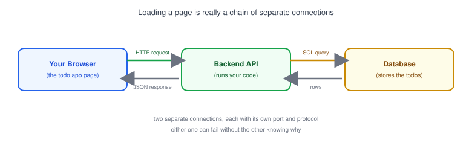
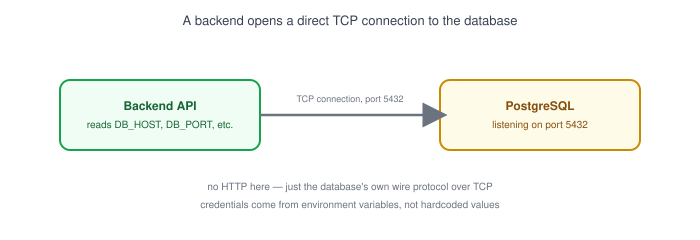
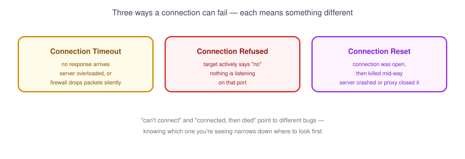

# Part 14: Client-Server Communication

## Table of Contents

- [1. The Request/Response Chain](#1-the-requestresponse-chain)
- [2. Making an API Request](#2-making-an-api-request)
- [3. Backend-to-Database Communication](#3-backend-to-database-communication)
- [4. Backend-to-Backend Communication](#4-backend-to-backend-communication)
- [5. When Things Go Wrong: Timeout, Refused, Reset](#5-when-things-go-wrong-timeout-refused-reset)

---

## 1. The Request/Response Chain



A single "load the page" action is really a chain of separate network connections, each with its own [IP address](../02-ip-address), [port](../04-ports), and protocol:

- **Browser → Backend** — your frontend code calls an API, usually over [HTTP/HTTPS](../06-http-and-https).
- **Backend → Database** — the backend opens its own connection (often [TCP](../05-tcp-vs-udp), on a database-specific port like 5432 for PostgreSQL) to fetch or store data.
- The response travels back the same chain, in reverse.

> **Note:** Each hop in this chain is a separate connection that can succeed or fail independently. "The site is down" might really mean the backend is fine but the database connection is failing.

## 2. Making an API Request

```bash
curl -i https://api.example.com/todos
```

```
HTTP/1.1 200 OK
Content-Type: application/json

[{ "id": 1, "title": "Buy milk", "done": false }]
```

- The frontend (a browser, or a mobile app) sends an HTTP request to a backend URL — this is exactly what `fetch()` or `axios.get()` does under the hood.
- The backend runs code, and sends back a response with a [status code](../06-http-and-https) and a body — usually JSON.
- If the backend takes too long, is unreachable, or crashes, the frontend sees an error instead of data — the rest of this part covers what those errors actually mean.

## 3. Backend-to-Database Communication



- Unlike a browser talking to a backend, a backend talking to a database usually isn't HTTP — it's a direct TCP connection using the database's own protocol (e.g., PostgreSQL on port 5432, MySQL on port 3306).
- The backend needs a **host, port, username, password, and database name** to connect — usually stored as environment variables, not hardcoded.
- If the database is unreachable, the backend should return a clear error to the frontend (like a `503`) instead of hanging — a slow or silent failure here is much harder to debug than a fast, obvious one.

## 4. Backend-to-Backend Communication

Backends often call other backends too — a checkout service calling a payment service, or your API calling a third-party service like a weather API. The same rules apply as browser-to-backend: it's a request over the network, and it can time out, get refused, or come back with an error status. The only difference is there's no user staring at a loading spinner — so backend-to-backend failures need to be logged, not just displayed.

## 5. When Things Go Wrong: Timeout, Refused, Reset



| Error | What it means | Common cause |
|---|---|---|
| **Connection timeout** | No response arrived in time | Server is overloaded, network path is broken, or a [firewall](../12-firewall) is silently dropping packets |
| **Connection refused** | The target actively said "no" | Nothing is listening on that [port](../04-ports) — wrong port, or the service isn't running |
| **Connection reset** | The connection was open, then killed mid-conversation | The server process crashed, or something (like a proxy or load balancer) closed the connection unexpectedly |

- These three errors look similar to a frustrated developer, but they point to very different problems — knowing which one you're seeing narrows down where to look first.
- `curl -v` (see [Part 13](../13-network-tools-for-developers)) shows exactly which stage a request failed at, which is often the fastest way to tell these apart.

**Next up:** [Part 15 — Reverse Proxy](../15-reverse-proxy), where we look at how a reverse proxy sits in front of your backend and handles routing, SSL, and more.
