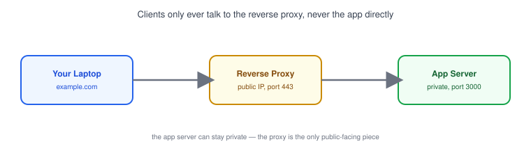
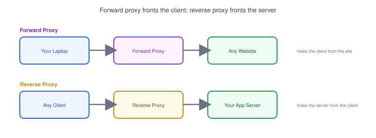
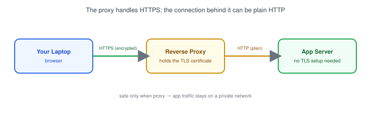

# Part 15: Reverse Proxy

## Table of Contents

- [1. What Is a Reverse Proxy?](#1-what-is-a-reverse-proxy)
- [2. Reverse Proxy vs. Forward Proxy](#2-reverse-proxy-vs-forward-proxy)
- [3. Domain → Reverse Proxy → Application](#3-domain--reverse-proxy--application)
- [4. SSL Termination](#4-ssl-termination)
- [5. A Simple Nginx Reverse Proxy Config](#5-a-simple-nginx-reverse-proxy-config)

---

## 1. What Is a Reverse Proxy?



A **reverse proxy** is a server that sits in front of your application and forwards incoming requests to it, then sends the response back to the client. The client only ever talks to the proxy — it never connects to your app directly.

- To the outside world, the reverse proxy *is* the server — your actual app can stay on a private [port](../04-ports) or private IP.
- Common jobs for a reverse proxy: routing requests to the right backend, [SSL termination](#4-ssl-termination), and (as covered next in [Part 16](../16-load-balancer)) spreading traffic across multiple backend instances.
- [Nginx](https://nginx.org/) is one of the most common reverse proxies used by developers.

## 2. Reverse Proxy vs. Forward Proxy



| | Forward Proxy | Reverse Proxy |
|---|---|---|
| **Sits in front of** | Clients | Servers |
| **Hides** | The client's identity from the server | The server's identity from the client |
| **Typical use** | Company network filtering outbound traffic | Routing/protecting a web app |

> **Note:** The direction is the easy way to remember it — a forward proxy forwards *your* requests out; a reverse proxy receives requests *in reverse*, on behalf of a server.

## 3. Domain → Reverse Proxy → Application

```
example.com  →  Reverse Proxy (port 443)  →  App Server (port 3000, localhost only)
```

- A domain's DNS ([Part 7](../07-dns)) points to the reverse proxy's IP, not the app server's.
- The proxy listens on the public-facing port (usually 443 for HTTPS) and forwards each request to the app server, often on `localhost` or a private network address that's never exposed to the internet.
- This means the app server itself doesn't need to worry about HTTPS, and can stay behind a [firewall](../12-firewall) that only allows connections from the proxy.

## 4. SSL Termination



**SSL termination** (or TLS termination) means the reverse proxy is the one that handles the HTTPS encryption/decryption — the connection from proxy to app server behind it can then be plain, unencrypted HTTP.

- The client's TLS handshake ([Part 6](../06-http-and-https)) ends at the proxy — hence "termination."
- This centralizes certificate management in one place instead of every app server needing its own TLS setup.
- It's safe as long as proxy → app traffic stays on a private network the public can't reach.

## 5. A Simple Nginx Reverse Proxy Config

```nginx
server {
    listen 443 ssl;
    server_name example.com;

    ssl_certificate     /etc/ssl/certs/example.com.crt;
    ssl_certificate_key /etc/ssl/private/example.com.key;

    location / {
        proxy_pass http://127.0.0.1:3000;
        proxy_set_header Host $host;
        proxy_set_header X-Real-IP $remote_addr;
    }
}
```

- `listen 443 ssl` — Nginx accepts the HTTPS connection from the client.
- `proxy_pass` — forwards the request to the app server running on `127.0.0.1:3000`.
- `proxy_set_header X-Real-IP` — since the app server now sees every request coming from the proxy's own IP, this header passes along the real client IP so your app's logs stay useful.

**Next up:** [Part 16 — Load Balancer](../16-load-balancer), where we look at spreading traffic across multiple backend servers instead of just one.
