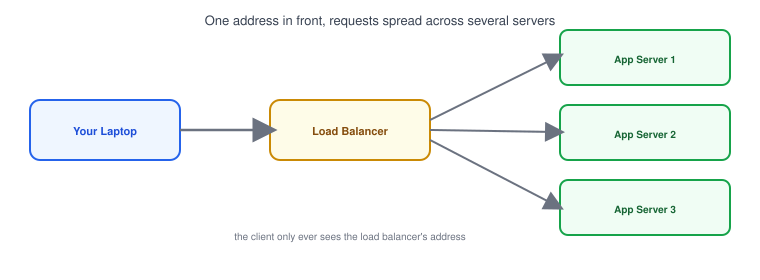
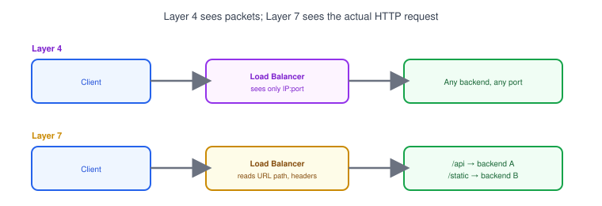
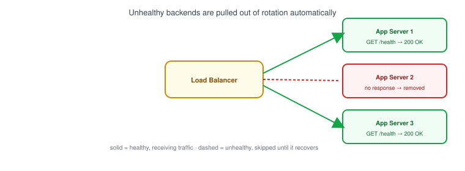

# Part 16: Load Balancer

## Table of Contents

- [1. What Is a Load Balancer?](#1-what-is-a-load-balancer)
- [2. Layer 4 vs. Layer 7 Load Balancing](#2-layer-4-vs-layer-7-load-balancing)
- [3. Health Checks](#3-health-checks)
- [4. A Basic Multi-Backend Architecture](#4-a-basic-multi-backend-architecture)

---

## 1. What Is a Load Balancer?



A **load balancer** sits in front of multiple copies of your app and spreads incoming requests across them, instead of sending every request to a single server.

- One server can only handle so many requests at once — running several copies and balancing traffic across them lets you handle more load, and keeps the app up if one server crashes.
- A load balancer looks a lot like the [reverse proxy](../15-reverse-proxy) from Part 15 — in fact, many reverse proxies (like Nginx) can do both jobs at once. The difference is just *how many* backends they're routing to.
- Clients only know about the load balancer's address; they never see or choose an individual backend server.

## 2. Layer 4 vs. Layer 7 Load Balancing



| | Layer 4 (Transport) | Layer 7 (Application) |
|---|---|---|
| **Decides routing based on** | IP address and port only | The actual HTTP request (URL path, headers, cookies) |
| **Can it read the request content?** | No — just forwards packets | Yes — can route `/api` and `/images` differently |
| **Speed** | Faster, less overhead | Slightly slower, more flexible |

- Layer 4 load balancing works purely with [TCP/IP](../08-osi-and-tcpip-models) info — it doesn't care whether the traffic is HTTP, a database connection, or anything else.
- Layer 7 load balancing understands [HTTP](../06-http-and-https) itself, so it can make smarter decisions — like sending `/api/*` requests to one set of servers and `/static/*` to another.
- Most developers reach for a Layer 7 load balancer (or reverse proxy doing the same job) unless they specifically need to balance non-HTTP traffic.

## 3. Health Checks



A **health check** is the load balancer periodically asking each backend "are you still working?" — usually by requesting a small `/health` endpoint and expecting a `200 OK` back.

- If a backend stops responding or returns an error, the load balancer automatically stops sending it traffic until it recovers.
- This is what makes a multi-server setup actually more reliable than a single server — one crash doesn't take the whole app down, it just reduces capacity until that instance comes back.

```bash
# what the load balancer is effectively doing every few seconds
curl -f http://backend-1:3000/health
```

## 4. A Basic Multi-Backend Architecture

```
                 ┌──────────────┐
example.com ───▶ │ Load Balancer│
                 └──────┬───────┘
                        │
        ┌───────────────┼───────────────┐
        ▼                ▼                ▼
   App Server 1     App Server 2     App Server 3
   (port 3000)       (port 3000)      (port 3000)
```

- All three app servers run the exact same code — the load balancer is what makes them look like a single service from the outside.
- This pattern is the foundation for scaling a backend horizontally (adding more servers) instead of vertically (making one server bigger) — a concept that comes up again when running containers, covered next in [Part 17](../17-docker-networking).

**Next up:** [Part 17 — Docker Networking](../17-docker-networking), where we look at how containers talk to each other and to the outside world.
