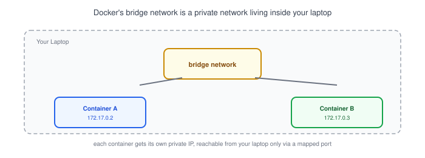
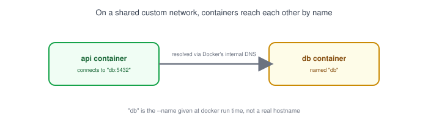
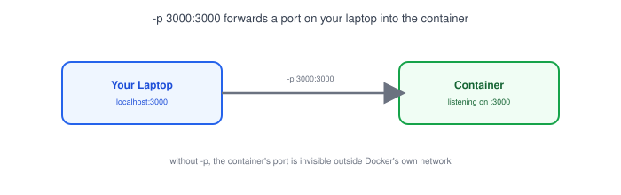

# Part 17: Docker Networking

## Table of Contents

- [1. Why Containers Need Their Own Networking](#1-why-containers-need-their-own-networking)
- [2. The Docker Bridge Network](#2-the-docker-bridge-network)
- [3. Container-to-Container Communication](#3-container-to-container-communication)
- [4. Port Mapping](#4-port-mapping)
- [5. "localhost" Means Something Different Inside Docker](#5-localhost-means-something-different-inside-docker)
- [6. Practical Example: Backend + PostgreSQL with Docker Compose](#6-practical-example-backend--postgresql-with-docker-compose)

---

## 1. Why Containers Need Their Own Networking

Each Docker container is isolated — it gets its own filesystem, process list, and by default, its own [IP address](../02-ip-address) on a private network that Docker creates automatically. Two containers on your laptop can't talk to each other just because they're on the same machine; they talk to each other the same way two separate computers would, over the network.

## 2. The Docker Bridge Network



```bash
docker network ls
```

```
NETWORK ID     NAME      DRIVER    SCOPE
c1a2b3d4e5f6   bridge    bridge    local
```

- `bridge` is Docker's default network — every container you run without extra config joins it and gets a private IP like `172.17.0.2`.
- It works like a mini home network ([Part 11](../11-nat)) living entirely inside your machine, with Docker acting as the router.
- Containers on the bridge network can reach the internet (outbound), but nothing on the internet can reach them (inbound) unless you explicitly map a port.

## 3. Container-to-Container Communication



```bash
docker network create app-net
docker run -d --name db --network app-net postgres
docker run -d --name api --network app-net my-backend-image
```

- Containers on the same custom network can reach each other **by container name** instead of an IP address — Docker runs its own internal [DNS](../07-dns) that resolves `db` to whatever private IP that container currently has.
- This is why a backend's database connection string in Docker often looks like `postgres://user:pass@db:5432/mydb` — `db` is the container name, not a real hostname.
- The default `bridge` network doesn't support this name-based lookup — that's one reason to create a custom network (like `app-net` above) for multi-container apps.

## 4. Port Mapping



```bash
docker run -d -p 3000:3000 my-backend-image
```

- `-p 3000:3000` means "forward port 3000 on my laptop to port 3000 inside the container."
- Without a `-p` flag, a container's ports are only reachable from other containers on the same network — not from your laptop's browser, and not from the internet.
- The format is always `host_port:container_port` — they don't have to match. `-p 8080:3000` would let you reach the container's port 3000 by visiting `localhost:8080`.

## 5. "localhost" Means Something Different Inside Docker

> **Note:** Inside a container, `localhost` refers to the container itself — not your laptop, and not other containers. A backend container trying to reach a database at `localhost:5432` will fail unless the database is running in that *same* container. Use the other container's **name** (see [Section 3](#3-container-to-container-communication)) instead.

This trips up almost every developer the first time they containerize an app that used to run `localhost:5432` locally — the fix is always to swap `localhost` for the database container's name.

## 6. Practical Example: Backend + PostgreSQL with Docker Compose

```yaml
# docker-compose.yml
services:
  api:
    build: .
    ports:
      - "3000:3000"
    environment:
      DATABASE_URL: postgres://user:pass@db:5432/mydb
    depends_on:
      - db

  db:
    image: postgres:16
    environment:
      POSTGRES_USER: user
      POSTGRES_PASSWORD: pass
      POSTGRES_DB: mydb
```

```bash
docker compose up
```

- Docker Compose automatically creates a shared network for all services defined in the file — so `api` can reach `db` by name with no extra `docker network create` step.
- Only `api` publishes a port (`3000:3000`) to your laptop; `db` stays reachable only from other containers on the same Compose network, the same private-database pattern from [Part 14](../14-client-server-communication).
- This is the same bridge-network + container-DNS behavior from Sections 2–3, just wired up declaratively instead of with individual `docker run` commands.

**Next up:** [Part 18 — Cloud Networking Basics](../18-cloud-networking-basics), where the same ideas — private networks, port exposure, service-to-service communication — show up again at cloud-provider scale.
