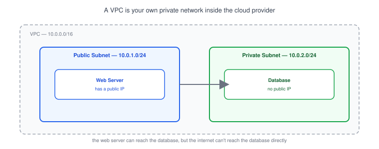
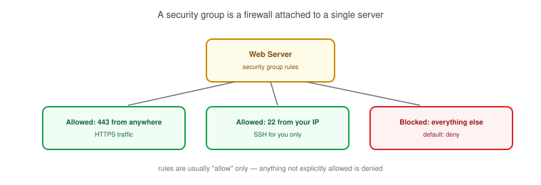
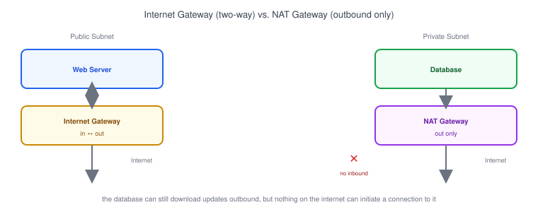

# Part 18: Cloud Networking Basics

## Table of Contents

- [1. What Is a VPC?](#1-what-is-a-vpc)
- [2. Public vs. Private Subnets](#2-public-vs-private-subnets)
- [3. Security Groups](#3-security-groups)
- [4. Internet Gateway vs. NAT Gateway](#4-internet-gateway-vs-nat-gateway)
- [5. Example AWS Architecture](#5-example-aws-architecture)
- [6. How a Developer Connects to a Cloud Server](#6-how-a-developer-connects-to-a-cloud-server)

---

## 1. What Is a VPC?



A **VPC** (Virtual Private Cloud) is your own slice of a cloud provider's network — logically isolated from every other customer's VPC, even though it's physically running on shared hardware. It's the cloud version of the home network from [Part 1](../01-what-is-a-network): you get your own address range and decide what's allowed in and out.

- A VPC is defined by a [CIDR block](../09-subnet-and-cidr-basics), e.g. `10.0.0.0/16` — the private IP range everything inside it uses.
- You divide the VPC into **subnets**, each with its own smaller CIDR range (e.g. `10.0.1.0/24`).
- Every major cloud provider has an equivalent: AWS calls it a VPC, Google Cloud calls it a VPC network, Azure calls it a Virtual Network.

## 2. Public vs. Private Subnets

A subnet is "public" or "private" based on one thing: whether it has a route to the internet.

| | Public Subnet | Private Subnet |
|---|---|---|
| Has a route to the internet | Yes, via an Internet Gateway | No direct route |
| Typical use | Web servers, load balancers | Databases, internal services |
| Reachable from the internet | Yes, if it has a public IP + open security group rule | No |

> **Note:** Putting a database in a public subnet doesn't automatically expose it — but it removes a layer of protection. The standard pattern is: public subnet for anything that must face the internet, private subnet for everything else, same idea as not exposing a database publicly that came up in [Part 12](../12-firewall).

## 3. Security Groups



A **security group** is a virtual [firewall](../12-firewall) attached directly to a server (or a group of servers), controlling inbound and outbound traffic by port and source.

```
Inbound rules for "web-server" security group:
  ALLOW  443 (HTTPS)  from 0.0.0.0/0
  ALLOW  22  (SSH)    from 203.0.113.10/32   <- your IP only
  (everything else denied by default)
```

- Security groups are **stateful** — if you allow an inbound request, the matching response is automatically allowed back out.
- Rules are almost always written as "allow" rules — there's no need to explicitly write a "deny" rule for everything else, since that's the default.
- Compare this to a subnet-level firewall (a "network ACL" in AWS terms): that applies to everything in the subnet, while a security group applies only to the specific server it's attached to.

## 4. Internet Gateway vs. NAT Gateway



- An **Internet Gateway** attaches to a VPC and gives public subnets a two-way route to the internet — servers with a public IP can both receive and send traffic through it.
- A **NAT Gateway** sits in a public subnet but is used by private subnets — it lets servers with no public IP make *outbound* connections (like downloading a package or calling an external API) without ever accepting *inbound* connections from the internet. This is the same [NAT](../11-nat) concept from Part 11, just running as a managed cloud service instead of a home router.
- A database in a private subnet with a NAT Gateway can still `apt update` or call a third-party API — it just can't be connected to from outside.

## 5. Example AWS Architecture

A small web app on AWS typically looks like this:

```
Internet
   │
   ▼
Internet Gateway
   │
   ▼
Public Subnet (10.0.1.0/24)
   ├── Load Balancer (Part 16)
   └── Web/App Servers  ──────┐
                               │ private connection
                               ▼
                    Private Subnet (10.0.2.0/24)
                    └── Database (e.g. RDS PostgreSQL)
```

- The [load balancer](../16-load-balancer) and app servers sit in the public subnet, reachable from the internet.
- The database sits in the private subnet, reachable only from the app servers' security group — never directly from the internet.
- This mirrors the same client → app → database chain from [Part 14](../14-client-server-communication), just deployed across cloud infrastructure instead of running on one laptop.

## 6. How a Developer Connects to a Cloud Server

Even a server in a public subnet isn't wide open — you still need the right security group rule and credentials to reach it:

```bash
ssh -i my-key.pem ubuntu@203.0.113.10
```

- This only works if the server's security group allows inbound port 22 from your IP (or from anywhere, though scoping it to your own IP is safer).
- For a web app, developers rarely SSH into every server directly — instead they push code through a deploy pipeline, and only the load balancer's address is public-facing.
- If a connection hangs instead of failing immediately, the most common cause is a security group silently dropping the packet — the same "connection timeout" symptom described in [Part 14](../14-client-server-communication).

**Next up:** [Part 19 — Network Security Basics](../19-network-security-basics), where we go deeper on TLS, SSH, VPNs, and keeping services like databases off the public internet.
