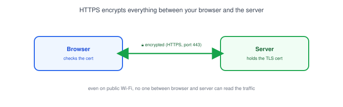
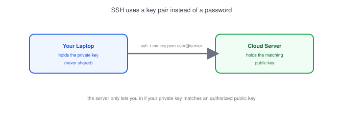
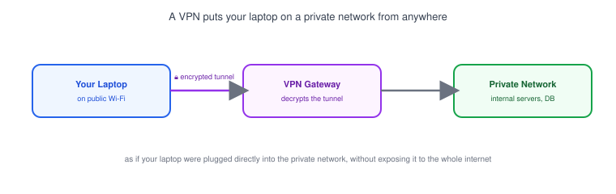

# Part 19: Network Security Basics

## Table of Contents

- [1. Why Network Security Matters](#1-why-network-security-matters)
- [2. TLS/HTTPS Recap](#2-tlshttps-recap)
- [3. SSH: Secure Remote Access](#3-ssh-secure-remote-access)
- [4. Firewalls and Security Groups Together](#4-firewalls-and-security-groups-together)
- [5. VPN Basics](#5-vpn-basics)
- [6. Don't Expose Databases Directly to the Internet](#6-dont-expose-databases-directly-to-the-internet)
- [7. A Few Core Principles](#7-a-few-core-principles)

---

## 1. Why Network Security Matters

Every part in this series so far has been about making things *reachable* — opening ports, routing traffic, connecting services. Network security is the other half: making sure only the *right* traffic gets through, and that what travels across the network can't be read or tampered with along the way.

- Most real-world breaches don't come from exotic attacks — they come from a port left open, a database with no password, or a service running without encryption.
- The goal isn't "block everything" — it's "allow exactly what needs to talk to what, and nothing else."

## 2. TLS/HTTPS Recap



[Part 6](../06-http-and-https) covered how HTTPS works — TLS encrypts the connection so that even on shared or public Wi-Fi, no one in between can read or modify the request.

- Any endpoint handling logins, payments, or personal data must use HTTPS — plain HTTP sends everything, including passwords, as readable text.
- A valid TLS certificate also proves the server is who it claims to be, not just that the connection is encrypted.
- Tools like Let's Encrypt make certificates free and automatic, so there's rarely a good reason to run a public service over plain HTTP anymore.

## 3. SSH: Secure Remote Access



**SSH** (Secure Shell) is how developers securely log into a remote server's command line — the same tool used to connect to the cloud server from [Part 18](../18-cloud-networking-basics).

```bash
ssh -i my-key.pem ubuntu@203.0.113.10
```

- Key-based authentication is safer than a password: your private key never leaves your laptop, and it can't be guessed or brute-forced the way a weak password can.
- The server only needs your **public** key on file — losing the public key isn't a security risk, but losing the private key means generating a new pair.
- SSH access should be restricted by security group ([Part 18](../18-cloud-networking-basics)) to your own IP where possible, not left open to `0.0.0.0/0`.

## 4. Firewalls and Security Groups Together

A [firewall](../12-firewall) and a cloud [security group](../18-cloud-networking-basics) do the same basic job — deciding what traffic is allowed in or out — just at different layers:

| | Firewall (e.g. `ufw`) | Security Group |
|---|---|---|
| Runs on | The individual machine's OS | The cloud provider's network layer |
| Blocks traffic | Before it reaches the OS's ports | Before it even reaches the machine |
| Typical use | Local/self-managed servers | Any cloud-hosted server |

> **Note:** Using both isn't redundant — a security group blocking a port stops the traffic earlier (saving the server the work), while an OS-level firewall is a second layer of defense if the security group is ever misconfigured.

## 5. VPN Basics



A **VPN** (Virtual Private Network) creates an encrypted tunnel between your laptop and a private network, so your laptop behaves as if it were plugged directly into that network — even from a coffee shop or home Wi-Fi.

- Companies use VPNs so employees can reach internal tools (admin dashboards, internal APIs) without exposing them to the whole internet.
- Everything inside the tunnel is encrypted, so even on untrusted networks, the traffic between your laptop and the VPN gateway can't be read by anyone in between.
- This is a different tool than HTTPS: HTTPS secures one connection to one server, while a VPN secures *all* your traffic to a private network.

## 6. Don't Expose Databases Directly to the Internet

This is the single most common networking mistake developers make when deploying for the first time: giving a database a public IP and opening its port to `0.0.0.0/0`.

```
❌  security group: ALLOW 5432 from 0.0.0.0/0     (database open to the entire internet)
✅  security group: ALLOW 5432 from app-server-sg   (only the app server can connect)
```

- A database almost never needs to be reachable from the public internet — only from the application servers that use it, which is exactly the private-subnet pattern from [Part 18](../18-cloud-networking-basics).
- If you need to inspect a production database directly, connect through SSH ([Section 3](#3-ssh-secure-remote-access)) or a VPN, not by opening the database's port to the world.
- Automated scanners constantly probe the internet for open database ports — an exposed, weakly-passworded database is often compromised within hours.

## 7. A Few Core Principles

- **Least privilege** — a service should only be able to reach (and be reached by) exactly what it needs, nothing more.
- **Encrypt in transit** — HTTPS for web traffic, SSH for remote access, a VPN for internal tools reached from outside the network.
- **Default deny** — start from "nothing is allowed" and open only specific ports to specific sources, rather than starting open and trying to close gaps later.
- **Keep private things private** — databases, internal admin panels, and metrics dashboards belong in private subnets or behind a VPN, not on the public internet.

**Next up:** [Part 20 — Network Troubleshooting: Real-World Project](../20-network-troubleshooting-project), where these fundamentals get put to use debugging real connection problems end to end.
